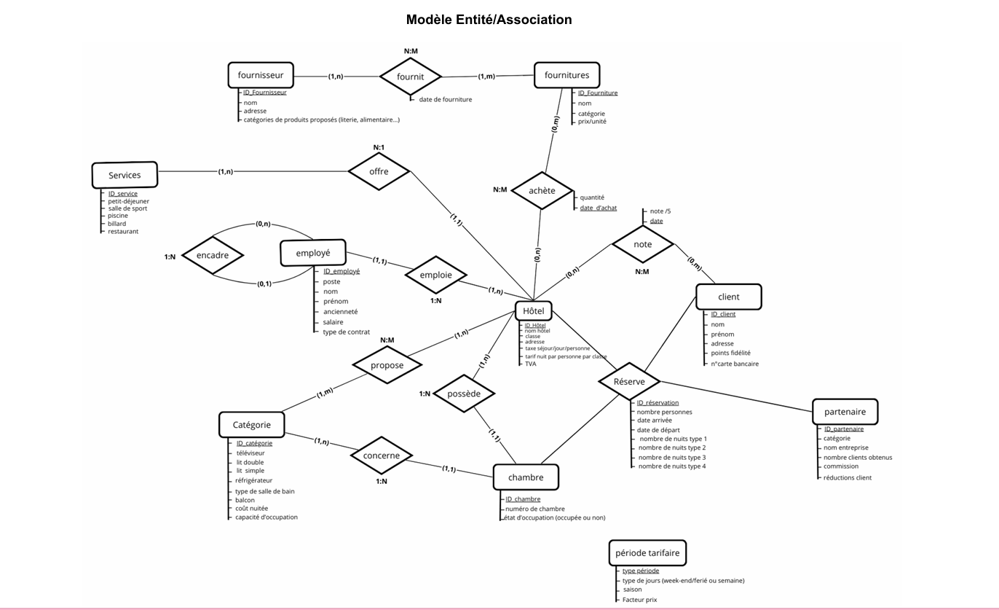
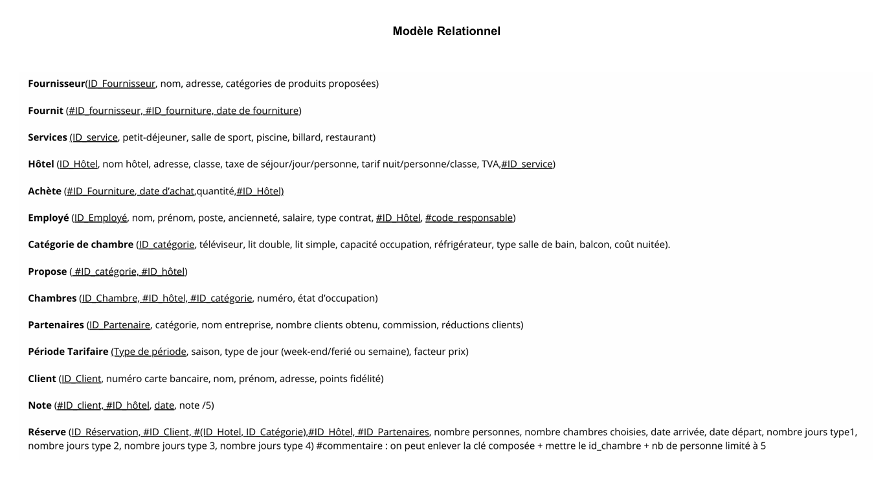

# projet-sql-hotel
# Projet SQL – Base de données Hôtel
Projet réalisé dans le cadre du Master 1 Bioinformatique et Biologie des Systèmes (travail en groupe de 3 étudiants).  
Objectif :concevoir et implémenter une base de données relationnelle permettant la gestion complète d'une franchise d’hôtels.

## Contexte
Une franchise hôtelière souhaite informatiser la gestion de son activité.  
Le système doit couvrir plusieurs aspects :
- Gestion des hôtels (nom, ville, classe, maître d’hôtel, services proposés)
- Gestion des chambres (catégorie, équipements, prix, disponibilité)
- Gestion des employés (poste, contrat, salaire, hiérarchie)
- Gestion des clients (coordonnées, carte bancaire, points fidélité)
- Gestion des réservations (dates, périodes tarifaires, réductions partenaires)
- Gestion des partenaires (agences, sites en ligne, commissions)
- Gestion des fournitures et fournisseurs (stocks, prix, catégories)
- Gestion des appréciations clients (notes /5, non vérifiées)

---

## Spécifications principales
1. **Hôtels**
   - Chaque hôtel a un nom unique par ville et est associé à une classe (1–5 étoiles).
   - Chaque hôtel est dirigé par un maître d’hôtel.
   - Taxe de séjour et TVA dépendent de la ville.
   - Services proposés : petit-déjeuner, salle de sport, piscine, billard, restaurant.

2. **Chambres**
   - Numérotation par étage (le premier chiffre = étage).
   - Catégories de chambres (lits, salle de bain, TV, frigo, balcon, capacité).
   - Prix dépend de la catégorie.
   - Statut : occupée ou libre.

3. **Employés**
   - Nom, prénom, poste, contrat, salaire, ancienneté.
   - Organisation hiérarchique : chaque employé est sous l’autorité d’un autre, sauf le maître d’hôtel.

4. **Clients**
   - Nom, prénom, adresse complète, numéro de carte bancaire.
   - Points fidélité accumulés après chaque réservation.

5. **Réservations**
   - Dates d’arrivée et départ, nombre de personnes.
   - Tarifs dépendant de la période (4 types : haute/basse saison, semaine/week-end).
   - Réductions possibles via points fidélité et partenaires.
   - Une réservation = une chambre.

6. **Partenaires**
   - Agence ou site en ligne.
   - Catégorie, nom, commission, clients apportés, réduction appliquée.

7. **Fournitures & fournisseurs**
   - Fournitures : nom, catégorie, prix/unité.
   - Fournisseurs : nom, adresse, type de matériel.

8. **Appréciations**
   - Notes données par les clients (sur 5).
   - Pas de vérification de séjour.

*Diagramme entité/association (MCD) du projet*


*Modèle relationnel final avec clés primaires et étrangères*



## À propos du script SQL

Le script `script.sql` contient toutes les instructions pour créer les tables, définir les relations (clés primaires et étrangères), et insérer des données de test pour simuler la gestion complète d’une franchise hôtelière.
Exemple de requête : Quels sont les partenaires qui ont amené les clients donnant en moyenne les meilleures notes? Classez-les selon, et baissez d'1% la commission du partenaire qui apporte les plus faibles notes.
```sql
-- Requête pour calculer la note moyenne par partenaire
SELECT P.nom, AVG(N.note) AS avg_note
FROM Reserve R
INNER JOIN Client C ON R.No_Client = C.No_Client
INNER JOIN Note N ON N.No_Client = C.No_Client
INNER JOIN Partenaire P ON R.No_Partenaire = P.No_Partenaire
GROUP BY P.No_Partenaire, P.nom
ORDER BY avg_note DESC;

-- Mise à jour de la commission du partenaire avec la plus faible note moyenne
UPDATE Partenaire
SET commission = commission - 0.01
WHERE nom = 'Les Amis du Voyage';

Résultat : 
| NOM                    | AVG_NOTE |
|------------------------|----------|
| Acme Inc               | 4,5      |
| ABC Travel             | 4,5      |
| Passion Voyages        | 4,5      |
| Techno Solutions       | 4        |
| Club des Randonneurs   | 4        |
| Globetrek              | 4        |
| Voyage Plus            | 3,5      |
| Vacances pour Tous     | 3,5      |
| XYZ Corp               | 3,5      |
| Les Amis du Voyage     | 3        |
